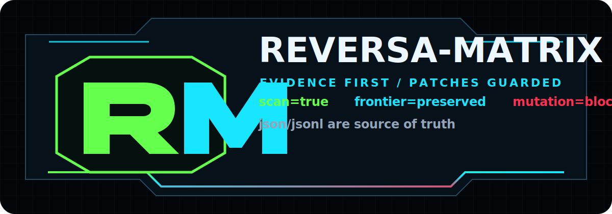
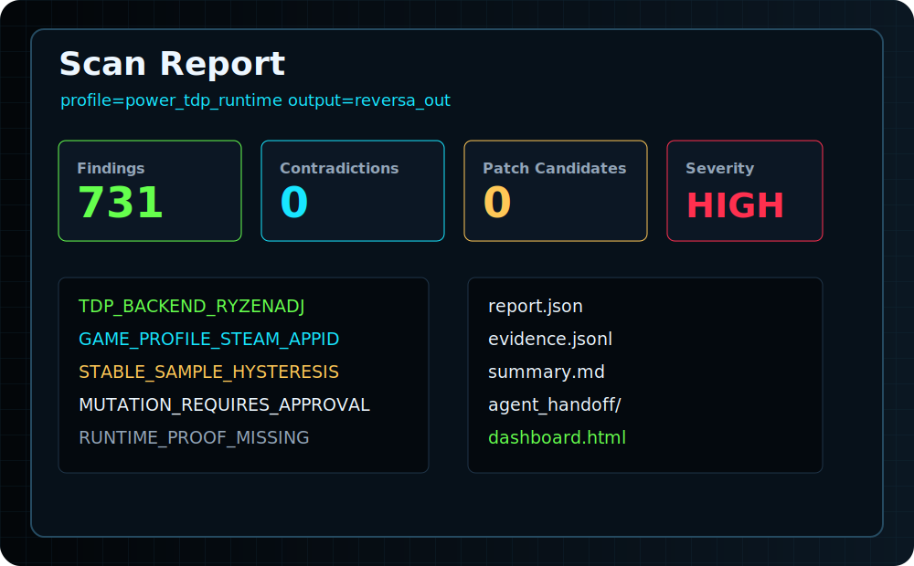
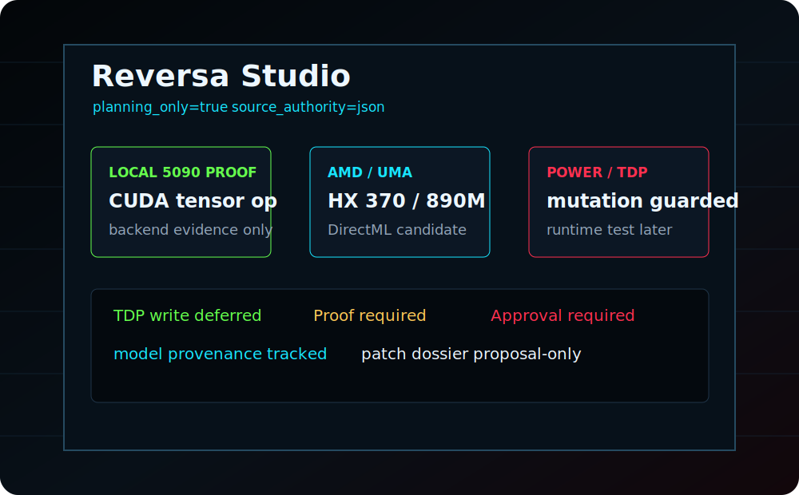
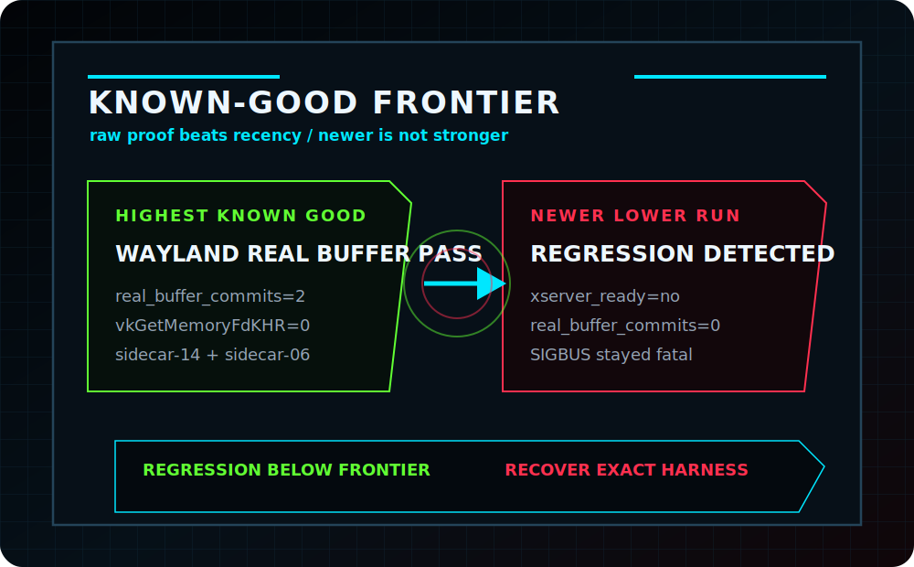

# Reversa-Matrix



Reversa-Matrix is an AI evidence, contradiction, and guarded patch-intelligence engine.

It turns messy repositories, logs, runtime traces, device reports, and agent instructions into traceable findings, contradiction maps, project memory/frontiers, guarded patch dossiers, review-only patch diffs, and agent-ready operating rules.

It is built to stop regressions, stale assumptions, and AI amnesia during complex engineering work. It starts with files, symbols, build declarations, device facts, paths, configs, logs, runtime traces, agent policies, and contradictions.

## Example Shots

These static examples show the current Reversa-Matrix visual direction:

| Scan dashboard | Reversa Studio | Frontier guard |
|---|---|---|
|  |  |  |

## What Reversa Is Now

- An AI evidence engine for codebases, devices, runtimes, games, and agent workflows.
- A contradiction detector for stale claims, policy drift, unsafe command plans, and copied constants.
- A guarded patch-intelligence layer that writes review artifacts before any source change.
- A project-memory and frontier tracker for long-running engineering work.
- A local model/eval lane for 5090/vLLM-backed advisory reasoning, with deterministic scanner truth preserved.
- A domain profile system for Android, Linux, Windows, games, containers, Vulkan/Wayland, kernels, and agent tooling.

## What Reversa Is Not

- It is not an autonomous unrestricted patcher.
- It is not a flashing, rooting, rebooting, or module-install tool.
- It is not a bypass, piracy, malware, or exploit-delivery system.
- It does not treat model output as proof.
- It does not replace human approval for destructive, device-mutating, or source-mutating actions.
- It does not bundle, own, or imply endorsement by upstream projects it scans or references.

---

## What It Is

Reversa-Matrix scans a source tree and emits structured evidence:

- findings with file and line references
- contradictions between source claims and known-good facts
- patch candidates that stay reviewable instead of automatic
- compare reports between current and reference trees
- offline dashboards for humans
- JSON/JSONL handoff bundles for Codex and other agents
- a local agent scaffold that owns memory, typed tools, policy, and reports
- an early local Reversa Studio dashboard prototype for evidence, model
  metadata, and guarded workflow planning

The core rule is simple:

```text
HTML is a view.
JSON and JSONL are the source of truth.
```

---

## Report Dashboard Preview

The generated report and offline dashboard share the Reversa-Matrix console identity:

<div class="rm-console-preview" aria-label="Reversa-Matrix console preview">
  <div class="rm-console-copy">
    <strong>Reversa-Matrix Console</strong>
    <span>AI evidence, contradiction, and guarded patch-intelligence engine.</span>
  </div>
  <div class="rm-console-graph" aria-hidden="true">
    <span class="rm-node evidence"></span>
    <span class="rm-node contradiction"></span>
    <span class="rm-node known-good"></span>
    <span class="rm-node patch"></span>
    <span class="rm-route route-a"></span>
    <span class="rm-route route-b"></span>
    <span class="rm-route route-c"></span>
  </div>
</div>

The visual model is evidence mapping first: source observations route into contradiction groups, known-good facts provide review context, and patch candidates stay separate until a human or agent validates them.

---

## Supported Direction

The current scanner already understands Android recovery-style trees and generic source trees. The project direction is broader:

| Platform | What Reversa-Matrix should map |
|---|---|
| Android | recovery trees, kernels, vendor blobs, fstab, init rc, BoardConfig, device facts |
| Linux | containers, distro roots, desktop graphics stacks, systemd, kernel/userland boundaries, handheld power daemons |
| Windows | source projects, drivers, services, registry assumptions, PE metadata, build scripts |
| Games | PCGamingWiki-style fixes, modding runtimes, graphics wrappers, widescreen/framegen evidence, Vulkan loader state, render enhancement manifests, game-aware Power/TDP profiles |
| Cross-platform | C/C++/Rust/Java/Kotlin/Python/JS projects, generated artifacts, copied constants, risky assumptions |

Reversa-Matrix is a platform-aware evidence and patch-intelligence engine, not a website modernization wrapper.

---

## Quick Start

Requirements:

- Node.js 18.20.2 or newer
- npm
- Git
- A source tree, config folder, log bundle, or extracted project to inspect

Clone and run the local CLI:

```bash
git clone https://github.com/Fractal-Echo/Reversa-Matrix.git
cd Reversa-Matrix
npm install
npm test
node ./bin/reversa.js scan --help
```

Run the included Android recovery fixture:

```bash
node ./bin/reversa.js scan \
  --project-root ./test/fixtures/android-recovery-current \
  --profile android_recovery \
  --known-good examples/known_good_rm11pro_nx809j.json \
  --out reversa_out
```

Open the local dashboard:

```bash
node ./bin/reversa.js gui --out reversa_out
```

Try the game/runtime fixture:

```bash
node ./bin/reversa.js scan \
  --project-root ./test/fixtures/bo3-runtime-diagnostics \
  --profile rm11pro_gaming_runtime \
  --out reversa_game_out
node ./bin/reversa.js gui --out reversa_game_out
```

---

## What You Get

```text
reversa_out/
+-- report.json
+-- evidence.jsonl
+-- summary.md
+-- report.html
+-- dashboard.html
+-- agent_handoff/
    +-- summary.md
    +-- findings.json
    +-- contradictions.json
    +-- patch_candidates.json
    +-- commands_to_run.md
    +-- known_good_facts.json
    +-- risky_assumptions.json
    +-- tree_inventory.json
```

Use `dashboard.html` to browse. Use `report.json`, `evidence.jsonl`, and `agent_handoff/` for automation.

Local agent runs write `.reversa/runs/<run-id>/` with a prompt, plan, tool call
log, evidence JSONL, contradiction YAML, and a Markdown report.

---

## Safety Model

Reversa-Matrix is read-only against the target tree during scan and compare. It does not flash devices, write partitions, run bootloader flows, or patch source files by itself.

When a command list contains risky operations, the dashboard separates them under:

```text
DESTRUCTIVE / HUMAN REVIEW REQUIRED / BACKUP REQUIRED
```

That safety boundary matters because Reversa-Matrix is meant for kernel, recovery, driver, and OS-adjacent work where a careless command can do real damage.

---

## Where To Go Next

- [Installation](instalacao.md)
- [Reversa identity](REVERSA_IDENTITY.md)
- [Online repo summary](ONLINE_REPO_SUMMARY.md)
- [First scan](uso.md)
- [CLI](cli.md)
- [GUI Dashboard](gui.md)
- [Reversa Studio](REVERSA_STUDIO.md)
- [Reversa Studio UI Blueprint](REVERSA_STUDIO_UI_BLUEPRINT.md)
- [Platform scope](platforms.md)
- [RM11Pro Fast-Test Facts](RM11PRO_FAST_TEST_FACTS.md)
- [Workspace Troubleshooting Facts](WORKSPACE_TROUBLESHOOTING_FACTS.md)
- [Evidence pipeline](pipeline.md)
- [Generated outputs](saidas/index.md)
- [Original Reversa compatibility](original-reversa-compatibility.md)

---

## Future Goals

- Runtime compatibility matrix across desktop and mobile Linux gaming profiles
- More render enhancement evidence for frame timing, texture replacement, HDR, and API translation
- Power/TDP research lanes for handheld daemons, battery caps, game profiles, and approval-gated tuning tests
- Broader Windows services, drivers, PE metadata, and registry-profile support
- Stronger Linux graphics and container diagnostics
